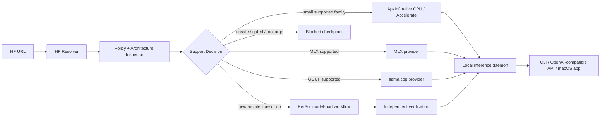

# macOS + Hugging Face Agent 化模型接入设计

日期：2026-08-23

状态：Qwen3.5-0.8B text-only tracer 已在本机通过 Transformers/ApxInf
oracle、真实 Accelerate CLI smoke、Seatbelt 内存 smoke、可恢复 bundle
staging、Rust `apxinf onboard` 及完全离线复用。HF source lock 和 Host
validators 已落地；KerSor v1 lock 能检测已绑定输入漂移，但尚未包含全部
Host/Codex 传递执行闭包。真实 Agent Intake 同时因该缺口与 Codex broker 的
auth symlink 可见性而默认阻断。Metal、vision、MTP、量化和本地 HTTP 服务仍
未完成。

## 1. 目标与非目标

目标是把用户入口收敛为：

```text
apxinf onboard https://huggingface.co/<owner>/<model> --target macos-arm64
```

系统随后应完成来源锁定、许可和安全检查、架构识别、部署路径选择、必要的模型接入开发、参考实现对拍、macOS 构建、内存与性能验证，以及本地应用打包。每个“已支持”结论都必须由可复现证据关闭，而不是由 agent 自报完成。

本设计当前不承诺：

- 任意 Hugging Face 模型都能被 ApxInf 原生执行；
- π0.5 已能在 macOS 上执行；
- 当前仓库已经具备 Metal 或 MLX backend；
- 未经用户同意即可接受 gated model 条款、执行远程代码或下载大权重；
- 在本机 Rust 工具链尚未就绪时声称构建通过。

## 2. 仓库与主机基线

### 2.1 Git 基线

- 工作目录：`/Users/haiyan-mini/Agent4Kernel/ApxInf`
- `origin`：`https://github.com/qhy991/ApxInf.git`
- `origin/main` 与本地 `main`：`c9abe712232607da1ae03d9b6bf872323571c4c1`
- `upstream`：`https://github.com/infinigence/ApxInf.git`
- `upstream/main`：`19bbb696f03e591b1916f4bd68a99b485b78c0c6`

两个 `main` 没有 merge base。它们分别包含同名的独立 initial commit，不能把上游简单描述成“fork 落后 2 或 3 个提交”，也不能直接 fast-forward/rebase。当前只配置 upstream fetch，push 被禁用；在用户选择迁移策略前不合并上游。

后续可选的历史处理方式：

1. 继续以 `qhy991/main` 为产品基线，只挑选上游的明确修复；
2. 新建以 `upstream/main` 为根的迁移分支，再移植 qhy991 的差异；
3. 保留两个 lineage，用补丁和验证报告做显式迁移。

推荐第 2 种，但它是独立决策，不应和 macOS tracer bullet 混在同一事务中。

### 2.2 macOS 基线

- Apple M4，arm64，16 GiB RAM；
- Xcode clang、CMake、Homebrew、`uv` 可用；
- 系统 Python 是 3.14.3，不宜作为首个 Transformers oracle 环境；建议由 `uv` 固定 Python 3.12；
- 已在 `/Users/haiyan-mini/Agent4Kernel/.apxinf-toolchains` 隔离安装 Rust 1.98；
  Qwen3.5 的 naive/Accelerate 测试、release oracle 与真实权重推理均已通过。

## 3. 当前能力判定

### 3.1 已落地的第一条 macOS 路径

`CpuBackend` 已包含 Llama 所需的 RMSNorm、SiLU、逐元素运算、矩阵乘、RoPE、embedding、KV cache 和 attention。`apxinf-core` 还已有 Apple Accelerate 的 F32 SGEMM 接口与 framework 链接逻辑。

根 `Cargo.toml` 现在已经把 `accelerate` feature 透传给 `apxinf-core` 和
`apxinf-model`；使用 `--features accelerate` 的构建会走 Apple Accelerate
F32 SGEMM。默认无 feature 构建仍走朴素 Rust 三重循环，因此部署回执必须
显式证明 binary 的 `matmul_feature=accelerate`。Attention 和 elementwise
目前仍是标量 CPU 实现。

当前第一条可信路径已经调整为：

```text
Qwen3.5-0.8B text-only -> SafeTensors -> CPU/F32 -> Apple Accelerate -> CLI
```

实现覆盖 18 层 Gated DeltaNet、6 层 full attention、混合状态/cache、partial
RoPE、严格 320 个 text tensor loader、Qwen 官方 non-thinking chat template，
并跳过 vision 与 MTP 权重。固定 Transformers oracle 的 10-token greedy
trajectory 已精确一致；M4 实测约 14.6–16.1 token/s，峰值约 3.6–4.8 GiB，
测试期间无 swap。完整证据见 `doc/20260823-qwen35-macos-bringup/README.md`。

### 3.2 当前不能列为 macOS 已支持的能力

- `Device` 只有 `Cpu` 与 `Cuda`，没有 `Metal`；
- 仓库没有 `apxinf-metal` 或 MLX adapter；
- `doc/zippy-hugging-cook.md` 描述的是缺失代码的旧计划，不能作为实现证据；
- 旧 `qwen3_vl` 的完整图文 CPU 路径仍缺 mRoPE、LayerNorm、GELU、bias、
  vision 2D RoPE 与 vision SDPA；新增的 `qwen3_5` 当前也只认证 text-only；
- π0.5 的注册和 runtime 被 `cuda` feature 隔离，不能作为 macOS 本地执行目标；
- `generate --model` 仍只接受本地目录；固定 Qwen3.5 URL 已由 Rust
  `apxinf onboard` 包装。这个入口不是任意模型路由器，只接受固定 commit，
  且缺失 bundle 只有显式 `--download-missing` 才允许联网；
- 当前 Llama loader 从 SafeTensors metadata 推导结构，缺字段时可能静默套用 TinyLlama 默认值，而不是严格解析 `config.json`；
- CPU 只自动把 BF16 权重转为 F32，F16 checkpoint 仍可能在 transpose 或 CPU op 处失败；
- CPU 构造会复制权重，KV cache 又按模型声明的完整 `max_seq_len` 预分配；32K/128K context 在 16 GiB Mac 上是直接风险；
- 当前没有 INT4 dtype，GGUF loader 也不能执行常见 Q4/Q8 权重；
- 原生 Metal backend 仍不存在。

## 4. 产品架构

目标系统不应把“原生 ApxInf kernel”当成获得可用 macOS 应用的唯一入口。建议增加请求级 provider seam：



### 4.1 `InferenceProvider` 边界

建议上层统一以下能力：

- `resolve`：模型引用到不可变 source lock；
- `capabilities`：task、modality、dtype、quantization、context、streaming；
- `load` / `unload`；
- `generate` / `generate_stream`；
- `health` 与资源占用；
- `deployment_manifest`。

Provider 初始为：

1. `native-apxinf-cpu`：小型 Llama-family 的正确性与原生开发基线；
2. `mlx`：Apple Silicon 上快速覆盖可用模型；
3. `llama.cpp`：GGUF 和量化模型路径；
4. `remote-vla`：Mac 仅作为 π0.5/OpenPI 客户端时使用。

Metal backend 是性能深化路线，而不是首个产品闭环的前置条件。

## 5. Hugging Face Resolver 与政策边界

### 5.1 两段式下载

阶段 A 只取有硬字节上限的结构化元数据和小文件：

- `config.json`、generation config；
- tokenizer 与 processor 配置；
- SafeTensors index；
- Hub 返回的文件大小、security status 与 resolved commit SHA。

模型卡、Jinja 模板和 repository prose 不进入 agent prompt。当前确定性
resolver 会校验 HTTPS canonical host、Hub Git blob SHA-1、LFS SHA-256、
单文件/总字节上限，并输出带 canonical content hash 的 `source-lock.json`；
SafeTensors payload 下载量固定为 0。

阶段 B 只有在政策和资源门通过后，才按 immutable commit 下载所需 SafeTensors shard。使用 allowlist，拒绝不必要的 `.bin`、`.pt`、`.pth` 和仓库脚本。

Hugging Face 的 `snapshot_download` 支持 revision、allow/ignore patterns 和 dry-run；生产 bundle 必须锁到 commit SHA，而不是漂移的 `main`。官方也明确提示 pickle 可导致任意代码执行，remote code 应固定 revision 并谨慎授权。

### 5.2 默认安全策略

- 默认只允许 `huggingface.co` canonical model URL 或 `owner/model`；
- 默认 SafeTensors-only；
- 默认 `trust_remote_code=false`；
- `auto_map` 触发审查，不自动等价为“必须执行 remote code”；
- gated model 的访问申请与条款接受由用户在浏览器完成，agent 不代为同意；
- license 缺失、自定义、非商业或再分发限制进入人工 checkpoint；
- token 只从环境或系统凭据读取，不进入 argv、Mission JSON、日志、source lock 或生成代码；
- 下载后记录路径、size、LFS/OID/ETag 与 SHA-256；
- 验证与部署阶段使用 locked bundle，并支持 `HF_HUB_OFFLINE=1` / `local_files_only=true`；
- model card 和仓库代码都按不可信输入处理，不能改变 Mission authority。

参考：

- <https://huggingface.co/docs/huggingface_hub/main/guides/download>
- <https://huggingface.co/docs/hub/security-pickle>
- <https://huggingface.co/docs/hub/models-gated>
- <https://huggingface.co/docs/transformers/models>

## 6. 模型接入分级

分类不能只看 `model_type`，还应读取 `architectures`、`auto_map`、task、quantization config、tensor name/shape/dtype fingerprint、tokenizer 和 processor。

| 分类 | 条件 | Agent 动作 | 自动继续 |
|---|---|---|---|
| `READY_EXISTING` | 结构和 tensor fingerprint 与现有实现匹配 | 锁版本、下载、生成 oracle、部署 | 是，低风险许可时 |
| `FAMILY_ADAPTER` | 计算图相同，仅 config/命名/权重前缀不同 | alias + 严格 config adapter + declarative weight map | 验证通过后 |
| `PORT_MODEL` | 新架构，但已有 primitive 足够表达 | 新增 config/weights/model/registry 与测试 | 否，进入写 Mission |
| `EXTEND_BACKEND` | 缺少目标 backend primitive | 先做 CPU oracle/op，再做目标 backend | 否，进入写 Mission |
| `EXTERNAL_PROVIDER` | 原生成本高，但 MLX/llama.cpp 已支持 | provider adapter + 应用验证 | 验证通过后 |
| `BLOCKED` | remote code、pickle、许可、gating、内存或 task 阻断 | 输出证据和最小解阻条件 | 否 |

## 7. KerSor 工作流设计

### 7.1 一个用户命令，分离确定性控制器与受约束 Mission

用户只需要触发一次 onboarding job，但控制器应顺序编译两个 KerSor Mission：

```text
URL
  -> deterministic resolver: immutable source-lock
  -> Mission A: read-only architecture intake
  -> port_manifest.json checkpoint
  -> controller validates exact transaction file list
  -> Mission B: transactional implementation
  -> Host candidate verifier
  -> deployment bundle
```

不能预先给 Mission B 一个“可以改整个仓库”的模糊权限。KerSor 的 `transaction_artifacts` 必须在 agent 运行前列出精确路径。已存在的目录不能作为事务快照，必须逐文件列举；尚不存在的新目录路径可以整体声明，并在候选失败时移除。因此 Mission A 先产出 machine-readable change manifest，控制器验证路径后再编译 Mission B。

两者可以位于同一个 Session v2 下的不同 `autonomous-runs`，从用户角度仍是一个可恢复 job。

### 7.2 Mission A：只读 Intake

建议 DAG：

```text
Resolve source ─┬─> Security/license assessment ─┐
                └─> Architecture fingerprint ────┼─> Support decision -> Port manifest
Resource model ───────────────────────────────────┘
```

必须产出：

- `source_resolution`：repo id、requested revision、resolved SHA；
- `security_assessment`：gated、license、formats、remote code；
- `architecture_fingerprint`：config 与 tensor schema；
- `resource_plan`：下载量、weights、KV 与 peak RSS 估计；
- `support_decision`：六级分类、provider、blockers、confidence；
- `port_manifest`：精确候选文件、必要测试、预期 app 类型。

Mission A 使用 ApxInf 专用的 KerSor read-only runtime config。安全事实不再由
worker 自报：source lock 与 port manifest 都由 `command-v1` Host evaluator 在
macOS Seatbelt 下以只读文件系统、拒绝网络、sealed output 复验。Agent 只负责
架构、资源与路由判断。

### 7.3 Mission B：实现与候选验证

控制器必须拒绝以下 transaction path：

- 绝对路径或 `..`；
- `.git`、`.kersor` 和 Host run directory；
- 模型权重、token、缓存或 workspace 外路径；
- 已存在的 directory path、symlink/hardlink 风险路径；
- 超出 intake 允许类别的文件。

随后生成包含精确 `transaction_artifacts` 的写 Mission。推荐节点：

1. strict loader/config 基础修复；
2. model-family adapter 或 model port；
3. 缺失 CPU primitive；
4. tokenizer/processor adapter；
5. provider 与本地服务；
6. app packaging；
7. Host candidate verifier。

每个 mutation capability 都必须：

- 使用 `transaction_artifacts`；
- `commit_failed_outputs=false`；
- 绑定 `candidate_verifier`；
- verifier 是 `retryable=false` 的 Host evaluator；
- node 为 terminal candidate，单次只产生一个候选；
- verifier 未通过时自动回滚并 replan，而不是保留半成品。

Host verifier 使用 exact argv，不经 shell；Cargo 的 `target` 指向临时目录，避免把构建副作用留在 workspace。最终 Completion 只投影二元事实，例如 `build_passed=true`、`oracle_passed=true`、`memory_passed=true`、`offline_smoke_passed=true`。

### 7.4 KerSor 与内核优化的职责分工

模型 port 正确性闭环后，再对 profile 确认的热点 primitive 分别启动固定任务 KerSor session：

- 一个 session 只优化一个 op/workload；
- CPU/Metal oracle 和 workload shape 固定；
- correctness gate 与性能门由 Host 测量；
- 未 profile 的算子不进入优化循环；
- model onboarding Mission 不调用嵌套的 `kersor-optimize`。

## 8. M4 16 GiB 验收合同

### 8.1 第一阶段硬门

- 首个真实模型：`Qwen/Qwen3.5-0.8B`，commit
  `2fc06364715b967f1860aea9cf38778875588b17`；
- Python oracle：由 `uv` 固定 Python 3.12 与依赖 lock；
- oracle requested context：32；部署默认 context 可逐级扩大到 4096，但每次
  扩大都必须重跑内存门；
- 预估 peak RSS < 9 GiB；
- 实测 child peak RSS < 6 GiB；
- 子进程 swap 必须为 0；host-wide pageout/swap 只记录为并发噪声证据；
- HF 与 ApxInf 前 10 个 greedy token 精确一致；
- tokenizer 的 raw/chat/special-token golden cases 精确一致；
- 三次 warmup，至少十次正式测量，报告 P50/P95、TTFT、TPOT 和 peak RSS；
- 从 clean checkout + locked offline bundle 可复现。

当前 CPU 路径的保守内存公式：

```text
peak ~= 8 bytes * parameter_count
      + 2 * layers * kv_heads * head_dim * requested_context * 4
      + activation/workspace
      + 20% safety margin
```

这里按至少 8 bytes/parameter，是因为磁盘 BF16 会被上转为 F32，当前构造路径还可能复制整套权重。必须先增加 `LoadOptions.max_context`，不能直接按模型声明的 32K/128K context 分配 KV cache。

### 8.2 `SUPPORTED` 的二元定义

一个模型只有同时满足以下条件才能进入 support registry：

- source 锁到 immutable HF commit；
- license/gated/security policy 已关闭；
- 未执行未经批准的 remote code，未加载 pickle；
- config 必填项严格解析，无静默架构默认值；
- tensor key/shape/dtype 100% 对应，遗漏均有解释；
- tokenizer/processor 对拍通过；
- activation/logits 数值门通过；
- 固定 fixture 的前 10 greedy token 一致；
- macOS arm64 clean build 通过；
- offline app smoke 通过；
- peak RSS/context/swap 门通过；
- 所有性能结论使用同一 revision、输入与 harness。

## 9. 分期路线

### P0：Qwen3.5 tracer（当前）

1. 明确 fork/upstream 迁移基线，不在实现中隐式合并；
2. 已安装并固定隔离 Rust；macOS arm64 portable CI 仍待加入；
3. 根 Cargo 已透传 `accelerate`；`--device auto` 仍待加入；
4. 已实现 Qwen3.5 strict config/weight schema、CPU primitives 与 runtime；
5. 已实现 `LoadOptions.max_context`、tied embedding 复用与 last-row prefill；
6. 已完成 Transformers activation/logits/cache 与 10-token oracle；
7. 已实现 metadata-only HF resolver/source lock、KerSor runtime 哈希绑定与
   port manifest Host validator；
8. 已对现有固定 bundle 完成全文件 hash、固定 arm64 Accelerate binary、
   Seatbelt offline CLI 10-token receipt、live memory receipt 与自校验
   deployment lock；
9. 已实现固定 URL/commit 的 metadata resolver、严格 SafeTensors stager、
   HTTP Range 续传、坏断点单次恢复、原子 no-replace 发布、existing-only
   离线复用，以及 Rust `apxinf onboard` v2；
10. 任意 URL 的架构路由、KerSor v2 外部执行闭包和 worker 不可读凭据通道仍
    待完成。默认不运行真实 Agent Mission。

### P1：先交付可用的 macOS 模型应用

1. 引入请求级 `InferenceProvider`；
2. 接 MLX 与 llama.cpp provider；
3. 增加本地 daemon：health、load/unload、`/v1/models`、`/v1/chat/completions` 与 SSE；
4. macOS UI 仅调用 daemon，不直接绑定底层 backend；
5. 上线两阶段 KerSor Mission compiler 与可恢复 job；
6. 认证第二个文本模型家族，再考虑 VLM。

### P2：原生 Metal 性能深化

1. 新建 `apxinf-metal`，增加 `Device::Metal` 与 `metal` registry suffix；
2. 首选 F16，实现 Llama 的 matmul、embedding、norm/activation、RoPE、KV cache、decode/prefill SDPA；
3. 禁止每层 GPU/CPU round-trip；graph capture 初期可 no-op；
4. 每个 Metal kernel 对 CPU oracle；
5. Qwen3.5 text-only 端到端正确后再做 command buffer batching/fusion；
6. Qwen3-VL 作为独立里程碑；π0.5 留作专门移植或 external provider。

## 10. 建议的仓库边界

未来建议新增：

```text
crates/apxinf-hub/              # URL resolve、metadata、source lock、cache
crates/apxinf-provider/         # provider trait 与选路
crates/apxinf-server/           # 本地 HTTP/SSE daemon
crates/apxinf-metal/            # P2 原生 Metal
deployments/<model-slug>/       # 仅小型 descriptor/lock；不存权重
.apxinf/onboarding/<job>/       # 本地生成的审计与 oracle 产物，默认 gitignored
kersor/                         # Mission 说明与生成入口
```

每个 onboarding job 的推荐产物：

```text
source-lock.json
model-info.json
safetensors-metadata.json
security-report.json
license-report.json
architecture-fingerprint.json
support-decision.json
port-manifest.json
oracle-env.lock
tokenizer-cases.json
reference-manifest.json
greedy-tokens.json
verification-results.json
memory-report.json
benchmark-report.json
deployment-manifest.json
```

权重、token、受许可约束的激活 fixture 不提交 Git，只保存 hash、生成方法和本地路径引用。

## 11. 下一条建议执行任务

已经关闭的第一条部署 tracer 是：

```text
Qwen3.5 HF URL
  -> deterministic metadata-only source lock
  -> hash-locked KerSor intake dry-run + deterministic Host verification
  -> immutable SHA + policy lock
  -> verified existing SafeTensors bundle reuse
  -> existing CPU + Accelerate oracle exact 10-token match
  -> offline CLI smoke + deployment.lock
```

Python controller 与 Rust launcher 已把上述确定性步骤收敛为固定 Qwen3.5
URL 入口。当前 release binary（含连续 `[H,K,V]` GDN state walk）SHA-256
为 `d9cb4de44b236b5b3f216a81079b11102220939a2b179cbc2678442ff947803b`；
旧 deployment locks 仍作为前一 binary 的不可变历史证据保留，新 binary
已在新路径 `deployment-lock-gdn-contiguous-v5.json` 通过完整离线验收，
content SHA-256 为
`c4089eb6a6f181ac4fb7aa9087beebd9e92e8c0f391e2dae52c92b44139622e0`。
新路径 staged run 的 live smoke 峰值 RSS `4,691,607,552` bytes、child swaps
`0`，固定十个 token 精确一致；deployment lock content SHA-256 为
`c7e14b676fb42567e973495939f662412a280bea6857a9a7604870bcbedee3c2`。
随后 existing-only 离线复用对全部 1,759,828,853 bytes 重新验 hash，明确记录
`network_used=false`，并产出 content SHA-256
`4e88dd1d90b2de3e7de82a2cfcd4ee9d9f583e9192581c35220ba85426448f3b`。

下一条工作是完成 KerSor v2 Host/Codex closure lock 并移除 worker 可读的
auth symlink，之后才能启用真实 Agent Intake；同时把 fixed-profile stager
泛化成由受信 source lock 编译的多模型 bundle plan。再用同一合同认证第二个
模型，并开始 Qwen3.5 原生 Metal 的逐算子 oracle/性能深化；Metal 不应绕过
source、bundle、oracle 与 deployment gates。
