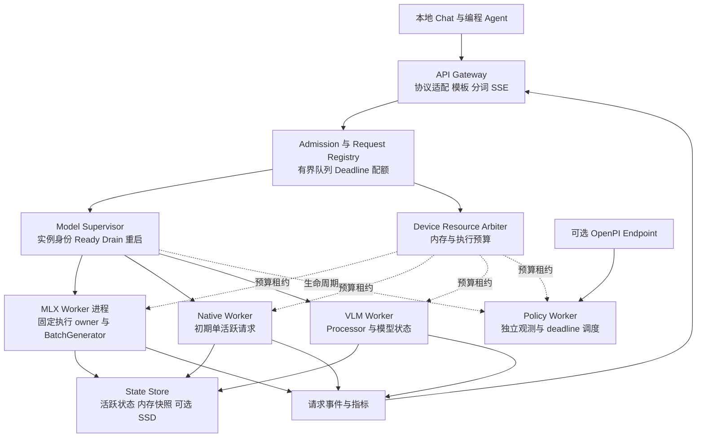

# ApxInf 面向 Mac 本地模型与编程 Agent 的 Serving 系统方案

日期：2026-10-09。状态：系统设计提案。首个串行子集已完成实机验证，范围见[本地服务说明](serving/local-service-v0.1.md)和[验证报告](serving/serving-validation-20261009.md)。本文其余路线仍为规划。

本方案以 Mac 本地 LLM／VLM 与编程 Agent 为优先场景，保留 CUDA／Jetson 和 PI0.5 的扩展边界。初始审计基线为 ApxInf `df5c55a06140107b24964d9e4abbefd9fa2a4733`。现状表描述该基线；外部机制依据官方文档与源码；后文的架构、阶段和验收条件属于设计建议。后续首个实现子集、已有本地模型实测和 Claude Code 结果见[实现与验证报告](serving/serving-validation-20261009.md)，不将这些结果扩展到尚未实现的路线。

2026-10-09 补充约束：允许参考其他仓库，但新增实现、测试和 fixtures 必须独立手写。不得复制、翻译、移植或改名套用外部代码。现有依赖的公开 API 调用可以保留，并记录依赖边界。已安装的 ASD-STE100 技能属于个人文档工具，不进入 ApxInf 运行时。

后续设计以[设计入口](serving/README.md)、[英文接口规范](serving/contracts-v0.1.md)和[实施计划](serving/implementation-plan.md)为配套文档。接口规范使用 ASD-STE100 Issue 9 的写作原则，并作为新 serving 接口的语义依据。本文件用于中文说明和调研，不声称符合 STE 英文标准。接口示意如与规范冲突，以规范为准。先确定完整框架与首个接口子集，再逐步编写实现，不一次性生成全部模块骨架。

建议新增 **ApxInf Serve：Rust 接入与资源管理层，加能力可协商的模型 worker**。Mac 首个实用执行路径继续使用已验证的 MLX provider，原生路径保留独立验证与演进空间。先建立可靠的流式服务，再接入 MLX 连续批处理和可恢复状态缓存；根据实际收益决定 SSD 缓存与原生批处理的投入。

Serving 的目标应是：编程 Agent 连续多轮运行时，首 token 等待可解释，输出不中断，客户端断开后能释放资源，长请求不会无限占住其他请求，模型与缓存不会挤垮统一内存。单条请求的 kernel tok/s 只是其中一个指标。

## 一 现状与真正需要补齐的能力

| 领域 | ApxInf 当前已实现 | Serving 缺口 |
| --- | --- | --- |
| 模型加载 | `AutoModel`、注册表、`LoadedModel::Text/Vla` | 部署模型目录、别名、版本、驻留生命周期和资源预算 |
| 原生文本生成 | `LlmTrait` 同步 greedy 生成、token callback、CUDA graph 路径及显式 Metal 实验路径 | 请求状态与权重分离、协作取消、多请求执行接口 |
| MLX 常驻服务 | 单模型 Python 进程；Rust 校验运行时、模型身份和 JSONL receipt | HTTP、SSE、token 事件、请求级取消、连续批处理 |
| MLX 会话 | 精确 append-only、4 个会话、512 MiB 逻辑缓存 LRU | 自动前缀匹配、分支、恢复快照、持久化和执行前内存准入 |
| 文本前处理 | Rust tokenizer、Jinja chat template | 富消息、工具调用、图片部件、增量解码和停止序列处理 |
| VLM | 原生 Qwen3-VL 的图像 prefill 接口 | Mac MLX VLM adapter；媒体处理、缓存身份及资源约束 |
| PI0.5 | 实际可用的 OpenPI WebSocket 与 Python policy／PyO3 路径 | 独立执行 owner、消息限额、观测时效、deadline 与资源治理 |
| 观测 | 引擎 TTFT／TPOT／TPS、MLX 分配峰值 | 网关排队、客户端 TTFT／ITL、拒绝率、状态驻留及模型切换指标 |

主要代码证据：

- [统一模型入口](../crates/apxinf-model/src/auto.rs)、[模型注册](../crates/apxinf-model/src/builtin.rs)、[生成接口](../crates/apxinf-model/src/llm_trait.rs)。原生 Qwen3.5 loader 仍限定 CPU/Accelerate，并提供显式 Metal W8 路径，不能将其描述为通用全模型 Metal backend。
- [MLX Rust 进程边界](../src/mlx_service.rs)、[JSONL CLI](../src/mlx_service_cli.rs)、[Python worker](../scripts/apxinf_mlx_serve.py)。`mlx-serve` 明确不监听网络，worker 完成整段生成后才返回结果。
- [会话缓存契约](20260823-qwen35-macos-bringup/mlx-session-prefix-cache-20260824.md)、[混合状态](../crates/apxinf-model/src/qwen35/state.rs)、[基础 KV 接口](../crates/apxinf-core/src/kv_cache.rs)。现有 KV 接口没有通用 snapshot／fork／restore。
- [Tokenizer](../crates/apxinf-tokenizer/src/lib.rs) 的消息类型只有 `role` 与字符串 `content`；[OpenPI transport](../python/apxinf/apxinf/serving/websocket.py) 已直接调用 policy，不是旧 TODO 中的逐请求 binary subprocess。

有四项现状会决定设计顺序。

第一，原生 `LlmTrait::forward(&mut self, ...)` 与模型自有状态绑定。给模型套一个 mutex 可以串行保护，却不能得到独立会话或真正的连续批处理。初版 native worker 应明确只执行一个请求。

第二，MLX 现有 512 MiB 限额只统计会话对象 `nbytes`，且主要在请求完成后检查，不涵盖权重、运行时保留内存、prefill 临时张量和请求期间的峰值。新服务必须在开始执行前做预算。

第三，context 检查分散。一次性 CLI 检查部署 `max_context`，常驻普通生成主要限制输入和输出各自的协议上限，session 路径另有总长度检查。Serve 应统一执行 `有效输入长度 + 输出预留 <= min(模型支持上限, 部署上限)`；多模态有效长度由 processor／adapter 提供，不能仅数文本 token。

第四，取消现在不是请求级能力。原生 callback 返回 unit；MLX 生成期间不读取下一条 stdin 指令，超时会杀掉整个 worker。因此取消设计涉及执行循环和内部协议，不能仅在 HTTP handler 中关闭连接。

## 二 外部引擎的取舍

| 参考对象 | 已核实的关键机制 | ApxInf 应借鉴 | 初期不直接搬入 |
| --- | --- | --- | --- |
| oMLX | MLX 批处理、模型池、热／SSD 前缀缓存、内存治理、API 适配 | Mac 场景的完整服务闭环；缓存与模型驻留共同管理 | 整个 Python 应用、管理 UI、当前依赖栈和所有缓存特例 |
| MLX-LM | 已有 `BatchGenerator`、prompt／decode 推进与缓存对象操作 | 作为 MLX adapter 的执行原语，减少自建张量调度 | 把上游 main 的能力默认赋予 ApxInf 锁定版本 |
| llama.cpp server | 协议层和执行层分离、slots、连续批处理、当前也有多模型 router | 独占模型执行 owner、轻量本机服务、清晰请求队列 | 将 slots／GGUF／其 cache layout 直接变成 ApxInf 核心接口 |
| Ollama | 模型驻留、keep_alive、预加载、内存不足排队及队列上限 | 易理解的模型生命周期、冷启动合并、空闲卸载 | 为多后端通用性复制一整套模型分发产品 |
| vLLM V1 | API／Engine Core／Worker 分工、token budget、chunked prefill、块级 prefix cache | 调度预算、引用计数、请求终结和缓存身份不变量 | CUDA PagedAttention 内核、分布式 worker 拓扑与 PD 分离 |
| SGLang | radix 前缀索引、缓存感知调度、混合状态预算、HiCache | 可恢复前缀接口、缓存收益评估、调度公平性 | 单机 Mac 不需要的 RDMA、跨节点缓存与 HBM/DRAM 复制拓扑 |

来源：[oMLX](https://github.com/jundot/omlx/tree/cc1fdc9a24053224521a8dc6e1350d64e8ec16f4)、[MLX-LM v0.31.3](https://github.com/ml-explore/mlx-lm/tree/ed1fca4cef15a824c5f1702c80f70b4cffc8e4dd)、[llama.cpp 开发文档](https://github.com/ggml-org/llama.cpp/blob/master/tools/server/README-dev.md)、[llama.cpp server](https://github.com/ggml-org/llama.cpp/blob/master/tools/server/README.md)、[Ollama FAQ](https://docs.ollama.com/faq)、[vLLM 架构](https://docs.vllm.ai/en/latest/design/arch_overview/)、[SGLang 调度源码](https://github.com/sgl-project/sglang/blob/main/python/sglang/srt/managers/schedule_policy.py)。滚动文档只代表本次查阅状态。

### oMLX 最值得学的机制

oMLX 将 API、模型驻留、每模型执行、缓存和内存治理串成一个整体。对于本地编程 Agent，连续多轮请求的首 token 成本和模型切换成本往往比单次短 prompt 跑分更值得优化。这个优先级适合 ApxInf；具体收益仍须用自身 workload 验证。

需要区分三件事：**多 HTTP 请求、多个 resident model、同一模型的多序列 batch**。三者分别解决接入、加载成本和执行吞吐，并不互相等价。当前 oMLX 代码采用每引擎执行线程和专用 MLX stream，不能将其概括成“所有模型全局单线程运行”。参考 [engine core](https://github.com/jundot/omlx/blob/cc1fdc9a24053224521a8dc6e1350d64e8ec16f4/omlx/engine_core.py)。

oMLX 的分块缓存管理也不能直接等同于 vLLM 的 kernel-native PagedAttention。所查普通 prefix restore 路径会从 hot／SSD 读取 blocks、拼接张量，再重建 MLX cache 对象。持久化／前缀索引的 block、执行时张量布局和 attention kernel 的分页寻址是三个接口；block 元数据共享不保证执行期间 KV 零拷贝共享。ApxInf 可以先获得前两项收益，后续再决定是否改原生 attention 内核。参考 [cache 重建](https://github.com/jundot/omlx/blob/cc1fdc9a24053224521a8dc6e1350d64e8ec16f4/omlx/cache/prefix_cache.py#L3162)。

当前所查 oMLX commit 的 `pyproject.toml` 要求 Python `<3.14`、MLX `0.32.3`，并固定另一个 MLX-LM git revision；ApxInf 边界则固定 Python `3.14.3`、MLX `0.32.1`、MLX-LM `0.31.3`。因此借鉴机制，并通过公开 API 调用现有依赖，不复制其实现；任何运行时升级都单独走版本和模型质量验证。参考 [oMLX 依赖](https://github.com/jundot/omlx/blob/cc1fdc9a24053224521a8dc6e1350d64e8ec16f4/pyproject.toml) 与 [ApxInf 固定版本](../src/mlx_service.rs)。

### MLX 批处理应从已锁定版本核对

MLX-LM v0.31.3 已提供 `BatchGenerator.next()`，每步返回 prompt 和 generation 响应，并有插入、移除和提取 cache 的接口；其执行中存在 decode 与有限 prompt chunk 的交替。`next_generated()` 可能在内部连续推进 prefill，不能把它当作最细的取消／进度检查点。参考 [固定版本生成器](https://github.com/ml-explore/mlx-lm/blob/ed1fca4cef15a824c5f1702c80f70b4cffc8e4dd/mlx_lm/generate.py)。

这里 `prefill_step_size` 是每条 prompt 的上限，不是全 batch 的总 token budget；`next()` 要等当轮 prefill 完成才返回已计算的 decode 输出。因此预算必须结合 prompt batch 数，且小步计算不自动等于低 ITL。该版本构造器还会调用 `mx.set_wired_limit`；generator 生命周期和内存设置的副作用应在 P0/P2 检查，不通过额外提高系统 wired-memory 上限掩盖容量问题。[逐步调度与构造实现](https://github.com/ml-explore/mlx-lm/blob/ed1fca4cef15a824c5f1702c80f70b4cffc8e4dd/mlx_lm/generate.py#L1544)

这意味着 MLX 路线不必等待 ApxInf 自写通用 batch kernel。但 model cache 是否可合并、请求 seed、draft 配置以及 cache 类型都会影响可用路径；应根据固定版本和模型实际探测并测试，不能直接宣布所有 Qwen3.5、量化缓存和投机解码组合都支持。参考 [固定版本 server](https://github.com/ml-explore/mlx-lm/blob/ed1fca4cef15a824c5f1702c80f70b4cffc8e4dd/mlx_lm/server.py)。

### 借鉴服务机制时保留硬件边界

vLLM 的块 hash 包含前驱块、当前 token 及额外身份，活跃块用引用计数保护；SGLang 的分层缓存区分设备、host 和存储。ApxInf 应保留这些逻辑不变量，但 Apple unified memory 下 CPU/GPU 共享物理容量，不能照搬两份独立内存预算。参考 [vLLM prefix cache](https://docs.vllm.ai/en/v0.20.1/design/prefix_caching/)、[SGLang HiCache](https://docs.sglang.io/docs/advanced_features/hicache_design)。

## 三 产品范围与架构选择

最先服务三类负载：单用户交互聊天；编程 Agent 的长系统提示、多轮工具结果追加；一个前台请求加少量后台请求。首版以单机和本机回环地址为默认部署形式。

完成普通 chat API 后，仍不能宣称“已支持编程 Agent”。Agent 就绪还需要工具调用模板和解析、工具结果回传、停止原因、取消、长 prefill 存活及所选客户端实际使用的 API。客户端若依赖 Responses 或 Anthropic Messages，需要相应适配与契约测试，不能仅改 base URL 后视为兼容。

| 路线 | 优点 | 成本与结论 |
| --- | --- | --- |
| 将 oMLX 作为外部服务代理 | 最快获得现成 serving 功能，可做比较基线 | ApxInf 更接近路由包装；状态与质量边界由外部栈决定。适合作为选用 adapter／对照，不是主架构 |
| 在 ApxInf 上新建完整 Python server | 易接 MLX／VLM 生态，API 迭代快 | 需要重新整合 Rust 身份验证和多后端控制面。若交付时间极短可选，但不是当前推荐 |
| Rust Serve 加独立 engine adapters | 延续现有验证边界，跨 backend 统一治理，模型生态仍可使用 Python | 有内部协议与 lifecycle 工作量；推荐主线 |
| 先全部改成原生 Rust 高并发引擎 | 长期控制力强 | 同时承担模型状态拆分、batch kernel 和服务建设，过大；作为后续性能路线 |

### 推荐结构



这是职责图，不要求每个方框成为进程。首版为一个 Rust 服务进程，加按需启动的模型 worker。MLX 保留现有进程隔离；native 模型在其 worker 的固定线程上构造和使用；控制面不接触 GPU tensor。相同模型实例只加载一份权重，不按 HTTP 连接复制模型。

### 两级调度与单一执行所有权

**Serve 决定请求能否进入、进入哪个实例，以及能使用多少资源；engine 决定每一步执行哪些 token。** 共用请求契约和预算语义，不强求 MLX／CUDA／VLA 共用一套 batch 算法。

- 网关负责校验、身份、deadline、队列和全局资源。等待模型加载、等待准入、等待执行必须分别可观测。
- 每个模型 engine 是其请求状态、batch、cache 引用和结束事件的唯一 owner。MLX adapter 内使用 `BatchGenerator`；不在 Rust 层再造一个与它争夺 token 调度的第二个 scheduler。
- device arbiter 负责跨模型容量与执行许可。Mac 初期保守地限制同一设备上的重计算并发，允许多个模型驻留；跨模型 GPU 并行作为之后单独测量的配置。
- 活跃上限由 engine 发布 credits；外层队列有界。engine 内尚未执行的 admitted 请求仍计入同一 request registry、deadline 与队列指标，避免不可见的多层堆积。
- PID／线程隔离不保证 GPU 时间隔离。若未来 PI0.5 需要严格控制周期，应使用专用设备或可验证的预留执行窗口，不能以普通进程优先级承诺硬实时。

实现上必须区分三种许可：**capacity reservation** 占用内存预算；**sequence credit** 占用 engine 活跃请求名额；**compute permit** 允许某 worker 向设备提交计算。P1 按整请求持有 compute permit，同设备初期只授予一个重计算 owner。P2 只有在 adapter 能返回控制权并确认该步设备工作完成后，才允许按推进步交还；有未完成异步工作时许可仍属原 owner。加载、warmup 和 restore 中的设备计算也服从该约束。多模型等待时要限制继续向旧 batch 加入新请求，或使用已验证的步间轮转，避免旧模型永不 drain。

这一边界与 ApxInf 现有“模型组织计算、backend 提供设备和算子”原则一致。scheduler 不进入 `apxinf-core::Backend`；状态导出和 batch 编排属于模型／runtime。[现有分层原则](design.md)

## 四 请求契约和 Worker 协议

### 内部请求与能力

内部请求至少含 `request_id`、`model_revision`、`capability_revision`、`workload_kind`、已规范化输入、生成参数、deadline、cache namespace、可选 session/version。API family 只改变外层转换，不能产生多套推理语义。统一术语和字段见[接口规范](serving/contracts-v0.1.md)。

worker 启动时返回能力描述。能力必须绑定 provider、runtime 版本、模型 bundle 和执行 profile，配置文件声明不足以证明支持。

| 能力组 | 建议字段 | 当前默认策略 |
| --- | --- | --- |
| 输入与输出 | text／image、greedy／sampling、logits／logprobs、tool parser | 只开放通过模型级测试的组合 |
| 推进 | token events、cancel granularity、prefill chunk、continuous batch | 现有 native 不宣称可取消；MLX v1 不宣称 token streaming |
| 状态 | exact append、snapshot、restore、fork、trim、state schema | 每项独立声明；snapshot 不意味着任意 trim |
| 资源 | effective context、max active sequences、memory estimator | 以部署和实测约束收紧模型广告值 |
| 执行配置 | weight／state dtype、量化、特定 kernel profile | 不静默切换质量等级或 backend |

`submit`、`cancel`、`events`、`stats`、`drain` 是共同边界。`step`、`snapshot`、`restore` 是 adapter 内部可选能力。不要要求所有 engine 都实现一个携带张量的巨型 Rust trait。

### 请求状态机

```text
received → validated → waiting_model / queued → admitted
         → prefilling / decoding → terminal

terminal 的公共结果状态：completed / cancelled / failed / expired
取消意图作为 pending control 单独记录。
资源结算状态独立于上述公共请求阶段。
```

每个请求最多一个逻辑终态；资源释放、cache unpin 和预算归还必须幂等。worker 崩溃时 supervisor 合成失败终态，将资源转入 pending-reclaim，待进程退出回收确认后归还租约。网络已经中断时无法保证客户端收到终态，内部清理仍必须完成。

“接受取消”“输出终结”“资源已释放”是三个不同时间点。预算只在 worker 确认安全完成／移除设备工作与状态引用后归还，或在进程已回收后归还；不能收到取消意图就立刻把同一份容量发给新请求。保留独立的清理确认事件与超时升级路径。

如果请求结束后保留 session 或 snapshot，相关内存租约必须原子转给新的预算 owner。`resources_released` 表示该请求不再拥有资源，不表示此前使用的全部内存都成为空闲。

会话使用单写者租约或 session version compare-and-swap。两个请求不能同时追加同一份可变状态；分支请求只有在 provider 支持 fork 时创建独立状态，否则按明确的 cache miss／重算策略处理。显式 session API 的版本冲突返回冲突错误，不能伪装成成功续写。

### MLX 内部协议升级

保留 v1 本地 JSONL 的稳定行为，增加独立 v2 流式协议。新协议沿用启动时的严格模型、解释器、runner、依赖身份验证，事件不重复携带完整 bundle manifest。

```text
ready(protocol, worker_epoch, identities, capabilities)
submit(request_id, attempt, model_revision, capability_revision, input, limits)
accepted(request_id, attempt)
prefill_progress(request_id, event_seq, consumed_position)
tokens(request_id, event_seq, output_index, token_ids)
stop_generation(request_id, attempt, cause, output_boundary)
cancel_request(request_id, attempt)
terminal(request_id, event_seq, status, cause, usage, state_result)
resources_released(request_id, event_seq, released_leases, retained_transfers)
```

这里只展示逻辑字段，不能直接作为完整 wire schema 实现。所有请求命令和事件都有完整 execution key，所有命令都有 command ID。具体语义由[接口规范](serving/contracts-v0.1.md)定义，首个实现子集的完整字段表与限额在 P0 固定。校验 worker epoch、request id、递增事件序号和唯一终态；stdout 仅用于协议，日志走 stderr。

输入控制读取必须独立于模型计算：可用专门 reader 加有界 mailbox，只有执行 owner 调用 MLX；取消／shutdown 使用预留容量和优先控制通道，不能排在满载 submit 队列之后。以后需要二进制媒体 IPC 时再升级为本地 socket／共享内存。不允许在现有同步 stdin 循环后简单追加一个永远来不及读取的 `cancel` 分支。

取消在安全的 token／prefill chunk 边界生效。未分块的长 prefill 期间，取消延迟至少包含剩余的当前调用；已提交 GPU 工作通常也无法由关闭 HTTP 立即中止。请求级取消失败或 worker 无响应时，最后手段是 worker 终止，并明确使该 worker 的所有会话失效。

客户端断开、超时、EOS、stop sequence、用户取消最终汇入同一清理路径。完整算子步失败后若状态可能部分修改，整个状态失效，沿用现有 Qwen3.5 的保守策略。

正常停止与取消使用不同语义。Gateway 匹配到 stop string 后发送 `stop_generation`，公共结果保持 completed／stop_sequence；用户取消才映射为 cancelled。已计算或在途的越界输出不再发送给客户端。文本停止位置可能落在 token 内部，不能据此宣称 recurrent state 也回到同一位置。

### 流式文本与慢客户端

执行线程不写 HTTP socket。各请求有按 token 数和字节双限额的输出通道；慢消费者超过缓冲或发送 deadline 时取消该请求，而不是阻塞全模型。协议 reader 必须继续消费其他请求事件，不能因单个流满而卡死整个 worker 的 stdout。

Gateway 使用经过验证的增量 detokenizer，保留跨 token 的 UTF-8／byte fallback 边界和 stop-string lookbehind。输出 token 与输出文本不是一一对应。工具调用和 reasoning parser 同样需要增量状态，不能将每个 token 独立 decode 后直接拼接。

长 prefill 可发 SSE 注释 keep-alive，但不把 heartbeat 计算为首 token。先完成校验与准入再提交流响应头；流开始后的错误用该 API 支持的流内终止方式返回，不能改写已经发送的 HTTP 状态码，也不能发送成功 finish_reason。

请求已产生任何对外输出后不自动重放。输出前也仅对明确无状态、可安全重复的请求允许有限重试；session mutation 和工具调用结果不能依赖透明重试维持一致性。

## 五 面向编程 Agent 的协议与 Prompt 层

建议按兼容 profile 发布能力，避免笼统的“OpenAI compatible”。

| Profile | 对外能力 | 验收重点 |
| --- | --- | --- |
| Text basic | `/v1/models`、`/v1/chat/completions`、stream/non-stream、usage、stop、错误结构 | 正确模板、增量文本、取消、finish_reason、最大上下文 |
| Agent chat | tools、tool_choice 的已支持子集、tool_call_id、工具结果消息、reasoning 字段策略 | 单工具与多工具、多轮追加、部分 JSON delta、模型原生模板匹配 |
| Client adapters | 按选定客户端需求实现 Responses 或 Anthropic Messages 子集 | 用固定客户端版本跑真实契约；明确不支持的 storage/background 等字段 |
| Vision chat | image content parts、媒体处理、视觉 token 预算 | 图像顺序、processor 一致、位置编码和恢复正确性 |

首版沿用现有 greedy 行为；省略 sampling 参数的默认值必须公开说明。非零 temperature、多个候选、logprobs、grammar 等在后端没有相应路径时明确拒绝，不静默忽略。原生 fast path 可直接返回 argmax token，加入采样或约束解码可能需要另一条 logits 路径，不能仅扩展 HTTP schema。

Prompt 层应是模型相关的 `PromptAdapter`：持有 tokenizer／template／processor 的固定版本，输出 canonical tokens、媒体描述和身份。文本模型优先复用 Rust tokenizer；必须依赖 Python processor 的 VLM 可在 worker 侧前处理，但每条路线只有一个权威结果，不能由 Rust 和 Python 各自重复套模板。

编程 Agent 的缓存复用依据完整规范化输入。修改 system prompt、改变 tools 排序、追加不同的 generation marker，都可能缩短可共享前缀；不要为了命中而重新排序工具或改变内容。消息语义的等价不保证 token 序列相同。

服务负责产生模型工具调用；工具的实际执行和工作区权限由客户端管理。首版不在模型服务里新增自动执行 shell／MCP 工具的 Agent loop。

管理 API 与推理 API 分开。建议提供受保护的模型状态、load/unload、能力和配置查询；公网／局域网部署需要显式 bind 与鉴权配置。请求体、媒体尺寸、队列、输出长度都有上限；错误返回稳定 code 和 request id，详细 traceback 留在本机日志。模型下载与依赖安装是显式管理操作，不由普通推理请求隐式触发。

建议错误映射为：400 参数／上下文／能力不支持，404 模型不存在，409 显式 session 版本或单写者冲突，429 队列／配额超限，503 worker 不可用或暂时无法接纳，504 执行 deadline 超时。发生在流开始之后的同类错误使用流内错误语义；拒绝计数和可重试原因单独记录。

## 六 连续批处理和公平调度

先区分 HTTP 并发、驻留 session 数和活跃 sequence 数。首版可以接受多个连接并有界排队，但每 native worker 保持一条 active sequence；MLX 在 P2 完成适配与验证后逐步提高 active batch。

MLX actor 的一轮逻辑建议为：

1. 消费取消和过期控制，移除已终结请求，归还状态与预算。
2. 检查输出通道、设备内存及 engine credits。
3. 将可接纳、batch-compatible 的请求插入 `BatchGenerator`。
4. 获得 device compute permit，调用一个可返回控制权的推进步，汇报 prompt 进度与 token 事件；只有对应设备工作完成后才交还许可。
5. 处理完成、缓存提交、统计和下一轮预算。

batch 相容性至少涉及同一模型实例、执行精度、cache 类型以及生成路径；使用固定版本真正支持的 per-request 参数，不要求无谓的参数一致，也不把不支持的差异塞进同一个 batch。

调度遵循有限 prompt chunk、有限 active sequences、输出 token 预算和内存租约。优先保护已在输出的交互请求，同时给新 prefill 保留机会；使用等待时间上限或 aging 防止长请求永久饥饿。MLX generator 提供的控制面决定最初能实现的策略范围，不能在设计层承诺底层 API 尚未支持的任意 token-budget 调度。

**Chunked prefill 必须把控制权还给调度器才有服务公平性价值。** 仅在一个不可中断的 Python 函数内部把 prompt 分成小块，未必能让其他请求输出或及时处理取消。用“一条长 prefill 加数条短 decode”的 trace 验证，而非只检查 chunk 参数存在。

参数先扫描而不照搬 oMLX 默认值：active sequences 从 1、2、4、8 逐档；prefill chunk 在模型和 generator 支持的范围内选择若干档。最终默认值由 P95 TTFT／ITL 与内存压力决定，不能只选最大总 tok/s 的点。

固定 MLX-LM 版本会将 `completion_batch_size` 提高到至少 `prefill_batch_size`，后者默认是 8。因此扫描 1／2／4 时必须显式同时约束两个参数和外层 credits；只设置 decode 并发并不等于实施了宣称的 active cap。[固定版本构造逻辑](https://github.com/ml-explore/mlx-lm/blob/ed1fca4cef15a824c5f1702c80f70b4cffc8e4dd/mlx_lm/generate.py#L1507)

原生批处理另走一条后续路线：`SharedWeights + RequestState + StepExecutor`，然后验证多 sequence／不同长度／mask／position，再决定 ragged batch 或 paged KV。CUDA graph 的 bucket、buffer 地址和捕获生命周期也属于该改造，不是服务层可以无条件包装出的能力。

## 七 将缓存设计为可恢复的推理状态

### 缓存分层

| 层 | 保存内容 | 生命周期 |
| --- | --- | --- |
| Active state | 正在执行的 KV、循环状态、采样／输出控制状态 | engine 独占可变；请求执行期间 pin |
| Warm snapshots | 不可变、可恢复的完整前缀快照或共享块加必要 sidecar | 内存预算下复用；只有未被引用时可驱逐 |
| Cold snapshots | 带身份与格式版本的持久化快照 | SSD 配额、原子提交、兼容校验 |

这是逻辑分层。Mac 上 active 与 warm 都消耗统一内存，增加 warm 层可能增加副本而非节省容量。需要由实际物理 allocation 去重计费，不能简单把逻辑 `nbytes` 相加或把 CPU/GPU 各算一个可用池。

### Qwen3.5 的特殊约束

当前 0.8B 路径同时包含 6 层 full-attention KV，以及 18 层线性注意力的 convolution history 和 Gated DeltaNet recurrent matrix。可复用前缀长度必须是**所有状态组件共同可恢复的位置**。[本地状态定义](../crates/apxinf-model/src/qwen35/state.rs)

oMLX 对 `ArraysCache` 使用非切片状态处理，并在不存在精确 recurrent checkpoint 时回退到更早的有效边界。特别是结束位置 1030、块边界 1024 的情况，不能把结束时的 live GDN state 标记为 1024 快照。MLX-LM v0.31.3 某些状态对象的 `size()` 也不能代表已消费 token 数，逻辑位置应由 adapter 的 checkpoint metadata 维护。参考 [oMLX 状态处理](https://github.com/jundot/omlx/blob/cc1fdc9a24053224521a8dc6e1350d64e8ec16f4/omlx/cache/type_handlers.py#L845)、[精确边界约束](https://github.com/jundot/omlx/blob/cc1fdc9a24053224521a8dc6e1350d64e8ec16f4/omlx/cache/prefix_cache.py#L2371)、[固定版本 cache](https://github.com/ml-explore/mlx-lm/blob/ed1fca4cef15a824c5f1702c80f70b4cffc8e4dd/mlx_lm/models/cache.py#L146)。

例如请求共享前 1800 token，但只有 1024、1536、2048 的完整混合状态 checkpoint，那么最多恢复到 1536，再重算 264 token；不能裁剪 2048 的 attention KV 后，留下 2048 的 recurrent state，并宣称恢复到 1800。

第一版自动 prefix cache 建议先保存轮次边界的完整不可变快照；确有长前缀复用需求时，再增加可配置间隔的 checkpoint。只存完整快照会有内存开销，但正确性边界明确。之后可共享 immutable KV blocks，同时为相应位置保存循环状态 sidecar；checkpoint 间隔要把 recurrent state 大小与实际命中收益一起考虑。

没有实现 snapshot／restore 的 adapter 继续使用 exact-append session。既有显式 session mismatch 保持拒绝语义；新 stateless chat 的自动缓存查找可以 miss 后从头计算，两者是不同接口政策。

### 已输出 token 不等于已消费 token

现有原生循环输出 N 个 token 后，通常只消费了 `prompt_len + N - 1` 个输入，最后输出 token 尚待下一次 forward；现有固定 MLX `generate_step` 路径在 yield 前已消费该 token，同步后状态达到 `prompt_len + N`。将两者统一成一个“cache token count”会引入重复消费或漏消费。[原生循环](../crates/apxinf-model/src/llm_trait.rs)、[MLX 位置契约](20260823-qwen35-macos-bringup/mlx-session-prefix-cache-20260824.md)

每个 adapter 必须拥有 opaque `ResumeCapsule`，对外至少报告：已消费位置、完整历史身份、schema、兼容 profile、内存大小；内部保存 pending input／next logits 或可重建它们的办法、cache tensors、RNG 和必要控制状态。只有完成相应设备同步的 capsule 才可提交为可恢复状态。

用户可见文本还可能隐藏 EOS、stop 字符串或 reasoning tokens。不能拿可见字符串长度或客户端回传文本替代真实 token history；重新模板化后若不再精确匹配，按 miss 处理。若取消发生在可变更新中途，该状态直接失效；不以最后成功发出的 SSE chunk 猜测可恢复位置。

恢复有两个语义入口：`restore_prefix` 为新请求恢复模型前缀状态，重新初始化该请求的 RNG、stop/tool/reasoning parser 和 stream progress；`resume_request` 才恢复同一暂停请求的生成控制状态。pending token 只有确实属于选定 canonical prefix 时才可补消费；上一次请求预测出来但不属于新前缀的 token 必须丢弃，不能连同旧 parser 状态带入新请求。

### 缓存身份和提交不变量

建议将 KV／模型状态身份与生成继续执行身份分开：

```text
StateIdentity = hash(
  model_bundle + model_config + adapter_or_lora + positional_config,
  tokenizer + template + processor + canonical_input_prefix,
  execution_profile + state_dtype + state_schema + runtime_compatibility,
  cache_namespace
)

ResumeIdentity = StateIdentity + generation_controls + RNG_state + stream_progress
```

图像内容、processor 配置、媒体顺序和位置描述进入 canonical input 身份。固定 token history 对应的 KV 复用不必机械地按 temperature 划分；但继续同一采样过程必须恢复其请求局部 RNG 和控制状态。

基础规则是：缓存不可变；restore 返回新活动句柄；fork 使用可靠 clone／CoW；活跃引用不能被驱逐；租户／工作区隔离来自服务端可信 namespace；失败不得提交半成品；不同 backend、量化、状态 ABI 默认不共享，直到有明确兼容实现。

内容索引先用简单、可测试的前缀结构；后续选择 radix tree 或链式 block hash。索引能找到最长 token 前缀，不代表 provider 能在该点恢复，应由 `restorable_prefix_len` 再收紧。

### SSD 缓存的启用条件

只有下面的实测条件成立才启用读取：

```text
读取 + 校验 + 反序列化 + 状态重建 + 同步成本
    < 相同前缀重新 prefill 的成本
```

先测长 prefix 的重启复用和 RAM 压力下的恢复；短 prompt 可能重算更快。写盘放在有界后台任务，缓存队列满时跳过可选缓存写入。涉及 MLX 求值、tensor 转字节的准备过程仍由执行 owner 安排，计入步延迟与临时内存；后台 writer 只处理已经稳定的 CPU bytes。不能承诺整个序列化过程免费，也不能让后台线程读取仍在原地更新的状态。参考 [oMLX 边界快照存储](https://github.com/jundot/omlx/blob/cc1fdc9a24053224521a8dc6e1350d64e8ec16f4/omlx/cache/boundary_snapshot_store.py#L3)。

格式包含 schema、runtime compatibility、所有必要控制字段、校验和与完整 manifest；临时文件写完后原子提交，启动时忽略未完成记录。限制总字节和保留时间，升级默认失效不兼容记录。验收必须覆盖**保存后真实续写**，仅张量读回相等不够。

## 八 内存准入与模型生命周期

每个设备／统一内存域只有一个全局预算 owner。准入采用估算加持续观测，不把 allocator API 误当 OS 硬限额。

```text
resident_weights
+ active_state_allocations
+ reusable_snapshot_allocations
+ peak_prefill_and_decode_workspace
+ runtime_and_allocator_reserve
+ in_flight_load_or_restore_reservation
+ pending_serialization_and_output_buffers
<= serving_budget

serving_budget <= physical_capacity - OS_and_other_apps_headroom
```

不同统计口径可能重叠，实际记账必须避免重复；物理可用容量之外还要观察进程 footprint、swap／memory pressure。预算租约必须原子获取，防止两个模型同时都“看见足够剩余内存”后一起加载。

pending-reclaim 仍占预算，直到 owner／supervisor 确认完成物理回收；allocator 继续保留的内存从请求账转入 runtime reserve，不凭逻辑请求结束直接视为系统可用容量。

普通全注意力的 KV 估计可从 `2 × layers × kv_heads × head_dim × tokens × bytes_per_element` 起步，再加入 padding、block rounding 和 workspace。Qwen3.5 应只对 full-attention 层应用该项，另加每 sequence 的卷积／循环状态。原生连续 cache 可能按 `max_context` 预分配，应按实际容量而非已填 token 数收费。

首版为请求预留 prompt 加最大输出的保守状态预算；以后只有在 provider 能可靠预占／恢复时才允许更激进的超额准入。一般顺序是驱逐未 pin 的 warm cache、停止可选持久化／prefetch、卸载空闲模型、限制新准入；活跃模型不因 LRU 被直接卸载。

模型实例状态建议为：

```text
REGISTERED → LOADING → WARMING → READY → DRAINING → UNLOADED
                         ↘ FAILED
```

同模型并发冷启动合并为一个 load future；loading 占用预算但不宣布 ready。ready 后暴露真实能力和身份；引用计数归零后才启动 idle TTL；固定常驻的模型不能被自动驱逐。记录 load p95、驻留命中率、卸载原因和重复加载次数，防止两个大模型来回切换造成 load/unload storm。[Ollama 生命周期实现参考](https://github.com/ollama/ollama/blob/main/server/sched.go)

配置至少包含 alias、bundle identity、provider、device、execution profile、context cap、queue/active limits、memory budget、pin/TTL、cache policy。客户端的 `model` 解析成固定实例 revision，请求期间配置热更新不能改变已绑定的权重或模板。

健康检查分离：liveness 表示服务循环存活；readiness 表示所需默认模型和预算可以服务；模型状态接口报告 loading/draining/failed。不要把“HTTP 能返回 200”视为 GPU 推理健康。

## 九 VLM 与 PI0.5 的扩展边界

Mac VLM 是主线的第二条模型能力路线。先评估选定 VLM 在 MLX 生态的执行、processor 与 batch 支持，再接入 `VisionTextWorker`。不能因为 oMLX 支持某些 VLM，就假设 ApxInf 当前 text-only MLX worker 已具备这些能力。

VLM 请求增加媒体解码、resize、patchify、encoder 和视觉 token 预算；分别测其耗时。媒体输入须有格式、数量、尺寸、解压后内存与有效长度上限。初版优先接收受控上传／data payload，远程 URL 获取另做明确政策。媒体传输不能无限扩大已有 JSONL 行；较大 tensor 使用本地共享内存／文件描述符方案时，需要生命周期和字节配额。

encoder feature cache 与 autoregressive state cache 分开。前者按图像内容和 processor／vision model 身份查找；后者还包含媒体插入位置、mRoPE 等模型位置状态。第一阶段 VLM 可以串行服务，后续只有对应 cache 和 batch 路径通过验收才开启合批。

PI0.5 保持 OpenPI wire protocol 与现有 policy processors。未来共用 model supervisor、设备预算、指标和错误治理，使用独立 workload scheduler：按 robot/session 排队、检查 observation 时间与 sequence，明确过期请求是拒绝还是被新观测替代。原有一请求一响应客户端不能无声丢请求；若采用 latest-observation 策略，必须在扩展协议中明确返回 superseded。

PyO3 model handle 为 `unsendable`，必须在执行线程／进程中构造并使用。不能把已经在主线程构造的模型交给 `asyncio.to_thread`。网络与推理分离后，health、取消和连接处理才不会被 blocking inference 长时间阻塞。[PyO3 约束](../crates/apxinf-py/src/lib.rs)、[现有 WebSocket 实现](../python/apxinf/apxinf/serving/websocket.py)

## 十 可观测性与验收方法

统一记录 `received → validated → queued → admitted → model_ready → cache_restored → prefill_done → first_token → terminal → resources_released` 的时间点。阶段可能重叠，trace 必须保留真实起止，不简单相加得出错误总时延。

| 指标 | 用途 |
| --- | --- |
| 客户端 P50/P95 TTFT、E2E | 用户真实等待；单独报告冷加载与热模型 |
| 客户端 ITL、engine token-step 时间 | 区分 GPU 推进和网络／合包带来的停顿 |
| queue wait、admission delay、load/restore time | 解释首 token 慢在哪一层 |
| 已完成请求的 output tok/s、requests/s、SLO goodput | 避免用取消请求或不可用延迟的吞吐美化结果 |
| active/waiting、拒绝/失败/取消/过期 | 判断负载、容量与服务稳定性 |
| reused input tokens、restore bytes/time、saved prefill | 判断缓存是否真的减少计算和 TTFT |
| 各内存类别、footprint、pressure、swap、SSD 字节 | 验证预算和长时间运行 |
| cancel-to-stop、cancel-to-reclaim、worker restart | 验证取消有效性与故障影响范围 |

注意区分“缓存请求命中率”和“复用 token 比例”；命中一个很短的 system prompt 未必显著降低 TTFT。长 prefill 的 SSE keep-alive 不能改变 TTFT 定义。参考 [vLLM 指标设计](https://docs.vllm.ai/en/latest/design/metrics/)。

### 基准工作负载

| 场景 | 覆盖的失败模式与收益 |
| --- | --- |
| 短 prompt 单请求，cache off | 服务层固定开销及原始生成正确性 |
| 2K／8K／更长上下文，按部署 cap 截止 | prefill 分块、内存估算、取消粒度 |
| 5–20 轮编程 Agent trace | tools／模板稳定性、真实追加命中、上下文压缩后的 miss |
| 并发 1／2／4／8，混合输出长度 | 批处理收益、单请求延迟和公平性 |
| 一个长 prefill 加多个短 decode | head-of-line blocking、ITL 尾延迟、饥饿 |
| cache off／RAM warm／SSD warm／restart | 缓存收益、恢复正确性、持久化兼容 |
| 断连、慢读取、deadline、worker crash | 清理、状态失效、输出背压、影响范围 |
| 双模型切换和内存压力 | 原子预算、模型抖动、load 合并 |
| VLM 相同图／不同图／不同位置 | encoder 与 state cache 的身份和语义 |

固定 Mac SKU、统一内存、OS、runtime/commit、模型 revision、量化、模板、输入输出、采样、缓存状态与热状态。先测固定并发，再使用有明确到达率的负载发生器观察排队，避免客户端等待上一请求完成掩盖过载。服务 p95 用足量请求及样本数报告，不用几次 kernel 平均值替代。

比较对象应包括 ApxInf 原有 MLX 路径、固定版本 MLX-LM server、oMLX；llama.cpp 可作为部署方案对照，但不同模型转换／量化的结果标明质量与格式差异，不能称作同条件 kernel 加速。当前阶段不引用外部宣传倍数作为 ApxInf 预期收益。

### 正确性门和采用门

- 同执行 profile 下的服务封装应保持现有 greedy 输出和 stop 语义；cache on/off、session append/fresh、save/restore 必须用完整续写对照。
- 连续 batch 可能改变数值计算路径。先比较 token、logits 和任务质量；有分歧须定位并建立明确质量 profile，不能把“加速后文本看起来正常”作为通过。
- 对生成 0／1／多 token、EOS、stop 跨 token、最后一步取消、append 错误、worker 重启分别验证 consumed position 与状态有效性。
- 两请求共享 prefix 后分叉，互不污染；同 session 并发追加冲突被检测；没有恢复能力时不宣称支持分支。
- 慢客户端不能阻塞无关请求；所有终结路径最终恢复 active count、cache refcount 和租约，长期运行无单调泄漏。
- 性能目标在 P0 实测后冻结：单请求固定开销、交互 TTFT/ITL 的目标、可接受取消回收时间和系统内存余量。后续优化必须在满足这些目标下提高 goodput，未达标的优化不默认开启。

## 十一 分阶段交付与依赖

| 阶段 | 交付内容 | 完成条件 |
| --- | --- | --- |
| P0 契约与基线 | 固定模型/runtime；worker/event/state/memory 契约；现有与外部服务基线；选定首批 Agent 客户端 | 能复现基线；接口和能力矩阵冻结；明确 SLO 与模型质量门 |
| P1 可用文本服务 | Rust gateway、单模型 supervisor、有界队列、context/admission、MLX v2 token stream/cancel、文本 API、现有 exact session 复用及 version、metrics | 不串状态；断连回收；slow-client 隔离；CLI 与 v1 行为不回归 |
| P2a Agent 接入 | tool/template/parser；按客户端选择 API adapter；多轮 session 对接 | 固定客户端完成工具调用和工具结果追加；不依赖批处理验收 |
| P2b Mac 并发 | MLX BatchGenerator、chunk 进度／取消、并发预算、公平性 | 混合负载 SLO；批处理质量通过；缓存 join/leave 正确 |
| P2c Mac VLM | 一个选定模型的串行 MLX VLM adapter、processor、媒体预算和 vision chat | 图片理解流程、模板、位置与内存通过；不等待 SSD／VLM 合批 |
| P3 混合状态缓存 | snapshot/restore、自动 prefix match、immutable RAM snapshots | Qwen3.5 全部状态位置一致；分支、evict、cancel、恢复续写通过；Agent TTFT 改善可测 |
| P4 按收益扩展 | 模型 TTL/LRU 和自动切换；SSD cache；通过模型能力门的 VLM batch／cache | 各功能独立收益／正确性门；稳定性与内存压力长测 |
| P5 原生并发与其他平台 | native state/weight 拆分、batch execution、必要的 paged kernel；CUDA／Jetson；Policy worker 治理 | 平台及模型独立验收，不阻塞 Mac 产品主线 |

P2a、P2b、P2c 是 P1 之后可独立交付的分支，资源有限时优先完成真实 Agent 工作流，再按使用频率选择 VLM 或批处理。P3 也可在身份与生命周期契约稳定后独立推进。既有 exact session 不要求先获得 snapshot 能力；新 batch 路径尚未证明可以安全提取／恢复某类会话时，该会话继续走已验证的串行 adapter，并公开实际执行路径。多模型预算和 supervisor 接口从 P1 具备，自动驻留策略在有真实第二模型需求时交付。

每个阶段应是一条可独立使用和回退的纵向功能，而不是先搭完所有抽象再接第一个请求。一个合理的首批路径是：**Qwen3.5 文本模型常驻 → 两个客户端同时请求但有界排队 → SSE 与断连取消 → MLX 实际合批 → 同一 Agent 多轮精确复用 → 安全自动前缀恢复**。

### 建议代码落点

以下是未来实施范围，不是本次已创建的模块。

| 落点 | 责任 |
| --- | --- |
| `crates/apxinf-serving/` | 请求/事件/能力契约、registry、admission、supervisor、metrics；初期按模块分，不急于拆很多 crate |
| `src/serve.rs` 或独立 `apxinf-server` binary | CLI 配置、HTTP routes、SSE、启动组装；Rust HTTP runtime 可选 Tokio/Axum，P0 固定依赖后再落地 |
| 现有 `src/mlx_service.rs` 的可复用边界 | 提取身份校验、启动和故障管理到 serving adapter；保留 v1 wrapper |
| 新 MLX streaming worker 模块 | v2 事件、控制 mailbox、BatchGenerator、模型局部 state store |
| `apxinf-tokenizer` 与模型 PromptAdapter | 富消息、模板身份、增量解码；Python VLM processor 保持明确边界 |
| `apxinf-model` 的后续 runtime 接口 | native request state 与 weights 分离；避免污染底层 Backend trait |
| `tests/serving/` 与 `benchmarks/serving/` | 协议和故障契约、缓存续写、客户端 trace、负载与资源证据 |

现有 `generate`、`mlx-serve` 和 OpenPI 协议保持可用。新增网络入口不放宽旧 worker 边界；显式 provider、量化 profile、bundle identity 和 fail-closed 行为应继续保留。

## 十二 设计决策与暂缓项

1. **采用 Rust 控制面加 engine adapters。** 相比外部代理，更能保留 ApxInf 的模型、质量和执行路径控制；相比一次性原生重写，能利用现成 MLX batch 原语。
2. **执行 owner 和 state owner 一致。** MLX 的 token 调度留在 MLX actor；全局只做准入和预算。消除跨线程 GPU 对象误用和双重调度。
3. **状态抽象先于自动缓存。** 对混合模型，恢复正确性决定缓存是否可用；`KVCache` 不是完整会话状态。
4. **先可靠串行流式，再批处理。** 流式、取消、错误和资源回收是所有性能优化的基础，不依赖原生批处理开发完成。
5. **先 RAM 可恢复快照，再 SSD 和 kernel 分页。** 三者各有收益和风险，分别测量；不能由 block 文件格式推导已有 PagedAttention。
6. **Agent 能力按客户端和模型验收。** API 名称、模型模板和增量 parser 缺一不可；工具执行留在客户端。
7. **对 MLX 版本升级保持独立评估。** 当前依赖与 oMLX 不一致，升级不是自动前置动作；若锁定版本存在阻碍所需能力的问题，再用候选环境验证。

首轮不建设集群控制面、PD 分离、跨节点 KV、RDMA、TP/PP、全套管理 UI、模型市场或一体化 Agent 工具执行器。投机解码、KV 量化、structured decoding 作为后续能力提案：各自有额外状态与质量约束，不与第一次 serving 改造捆绑。

落地前仍需 P0 确认三项输入：目标 Mac 的容量档位；首个真实模型／量化 profile；首先支持的编程 Agent 客户端及其 API。它们影响容量、兼容范围与验收数值，不改变上述主要系统边界。

## 附录 调研来源与版本边界

本地代码以文首 commit 为准；旧 TODO 与设计文档若冲突，以所审计实现为当前事实。

| 来源 | 查阅范围 |
| --- | --- |
| [oMLX 固定提交](https://github.com/jundot/omlx/tree/cc1fdc9a24053224521a8dc6e1350d64e8ec16f4) | 2026-10-08 提交；scheduler、engine core、cache、engine pool、依赖；不把 README 吞吐宣传作为测量证据 |
| [MLX-LM v0.31.3](https://github.com/ml-explore/mlx-lm/tree/ed1fca4cef15a824c5f1702c80f70b4cffc8e4dd) | ApxInf 固定依赖对应源码；generate、server、cache；BatchGenerator 的存在不等于已在 ApxInf 接通 |
| [llama.cpp server 开发文档](https://github.com/ggml-org/llama.cpp/blob/master/tools/server/README-dev.md) | 滚动 master，2026-10-09 查阅；线程、slots、请求及协议边界 |
| [llama.cpp server 用户文档](https://github.com/ggml-org/llama.cpp/blob/master/tools/server/README.md) | 滚动 master；连续批处理、router、模型生命周期 |
| [Ollama FAQ](https://docs.ollama.com/faq) 与 [scheduler](https://github.com/ollama/ollama/blob/main/server/sched.go) | 驻留、排队、并行度及模型释放 |
| [vLLM 架构](https://docs.vllm.ai/en/latest/design/arch_overview/) 与 [调优](https://docs.vllm.ai/en/latest/configuration/optimization/) | V1 层次、chunked prefill、预算与抢占取舍；latest 为滚动文档 |
| [vLLM v0.20.1 prefix cache](https://docs.vllm.ai/en/v0.20.1/design/prefix_caching/) | block hash、附加身份、完整块和引用生命周期 |
| [vLLM AsyncLLM](https://github.com/vllm-project/vllm/blob/ab905a885dfbfc60a2c02286cc9c608c93884de3/vllm/v1/engine/async_llm.py) | 请求取消到 engine abort 的连接 |
| [SGLang scheduling](https://github.com/sgl-project/sglang/blob/main/python/sglang/srt/managers/schedule_policy.py) | 滚动 main；缓存感知 policy 与混合状态额外预算 |
| [SGLang HiCache](https://docs.sglang.io/docs/advanced_features/hicache_design) | 设备／host／storage 分层与恢复策略；硬件拓扑不直接移植到 Mac |

辅助使用本地 `metal-kernelwiki` 的测量、MLX serving 与 cache persistence 资料，主要用于检查版本、同步、缓存恢复和指标边界。该知识库中未公开原始文件的本地实验未作为 ApxInf 性能结论；本方案采用条件仍要求在目标版本执行端到端验证。
